# LLM-Based Recommendation

## 早期工作
### Zero-shot Recommendation:
#### LLMRank [[arxiv](https://arxiv.org/abs/2305.08845)] [[pdf](./LLM-Based-Rec-Papers/2305.08845v2.pdf)]
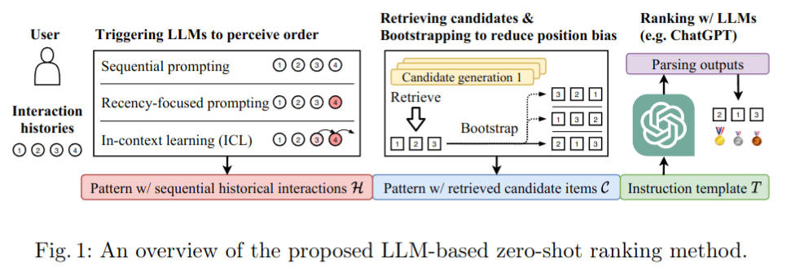--Prompt Engineering

* 针对的问题
    * 用户偏好建模的局限性：仅依赖历史行为（如点击序列）难以捕捉复杂的用户兴趣。
    * 常识和背景知识的缺乏：传统模型通常是“窄专家”，难以处理依赖丰富背景知识的复杂推荐任务。
* 本文旨在回答
    * 哪些因素影响LLMs的零样本排序性能？
    * LLMs在推荐任务中依赖哪些数据或知识？
* 方法设计
    * 形式化：将推荐问题转化为条件排序问题
    * 基于LLM做排序
        1. 指令生成与prompt模板设计
        2. 历史交互序列的prompt设计 
            * 顺序提示(sequential prompting)：直接按照交互的时间顺序排列
            * 强调最近提示(recency focused prompting)：顺序提示基础上额外强调最近的交互
            * 上下文学习(In-Context Learning)：在提示中加入示例对LLM做引导
        3. 候选项的prompt设计
            * 由候选生成模型检索得到候选项，并在提示中按顺序排列。
            * （其中随机调整选项的排列顺序，从而研究LLM是否受Position Bias的影响）
        4. 排序与输出结果
            * 输出自然语言格式，使用字符串匹配与候选项集C进行对齐，解析最终的推荐结果
    * 偏差分析与改进
        1. Position Bias
            * 位置靠前容易被推荐
            * Bootstraping(引导增强)：即对候选项集随机排列多次，将多轮结果合并
        2. Popularity Bias
            * 流行度高的容易被推荐
            * 减少历史交互的长度，使LLM更关注最近的交互
        


### SFT Training 对齐推荐性能:

#### TALLRec [[arxiv](https://arxiv.org/abs/2305.00447)] [[pdf](./LLM-Based-Rec-Papers/2305.00447v3.pdf)]
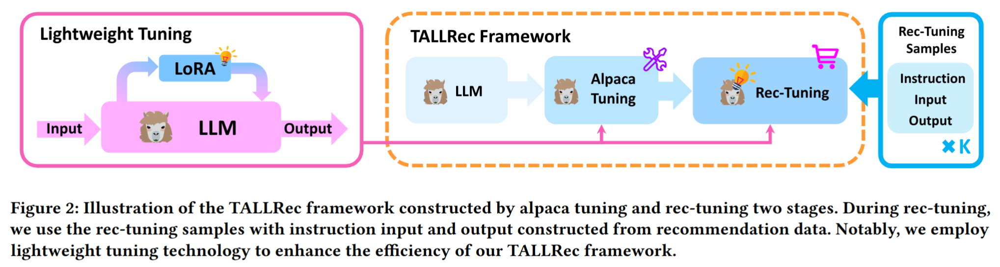
* 面对的问题
    * LLMs在推荐任务上的表现欠佳，原因主要包括：
        * LLM的训练任务与推荐任务之间存在巨大差距
        * LLM在预训练过程中缺乏足够的推荐相关数据
    * 传统模型对候选项的覆盖能力有限，可能遗漏目标项目

* 提出TALLRec（Tuning framework for Aligning LLMs with Recommendations），通过 Instruction Tuning 的方法对LLMs进行轻量化调优，使其能够适配推荐任务
    * 指令调优：通过人类标注的 Instruction 和响应 Response 训练LLMs
    * 推荐任务中，这里的 Response 一般为 `yes/no`

* 两阶段轻量化调优过程（Alpaca Tuning和Rec-Tuning）
    * 两阶段调优
        1. Alpaca Tuning
            * 首阶段通过自监督指令数据（如Alpaca自指令数据）训练模型，增强LLMs对新任务的泛化能力
            * 目标是优化语言建模优化函数： 
            $$
            \max_{\Phi} \sum_{(x, y) \in Z} \sum_{t=1}^{|y|} \log P_{\Phi}(y_t | x, y_{<t}),
            $$
        2. Rec-Tuning
            * 第二阶段专注于推荐任务，通过推荐数据进一步调优模型
            * 调优目标类似于Alpaca Tuning，但使用推荐任务的指令输入输出对模型进行微调
    * 轻量化调优：使用LoRA进行调优
        1. 冻结预训练模型的大部分参数，仅在每层Transformer中引入可训练的低秩分解矩阵
        2. 优化目标转为：
        $$
        \max_{\Theta} \sum_{(x, y) \in Z} \sum_{t=1}^{|y|} \log P_{\Phi+\Theta}(y_t | x, y_{<t}),
        $$
    * 用LLaMA-7B作为主干模型


#### InstructRec [[arxiv](https://arxiv.org/abs/2305.07001)] [[pdf](./LLM-Based-Rec-Papers/2305.07001v1.pdf)]
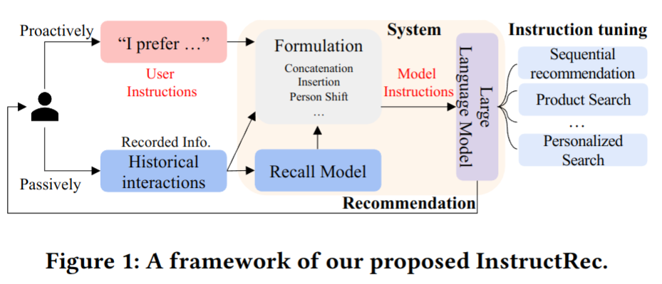

* 问题
    * 大语言模型（LLMs）在自然语言任务中的表现卓越，但推荐系统主要处理用户行为数据，与LLMs预训练的自然语言数据存在较大差距
    * 如何有效地让LLMs适配推荐任务，同时准确理解用户行为数据，是一个关键挑战
* 目标
    * 将推荐任务转化为LLMs的指令跟随任务（instruction following），让用户通过自然语言表达自身需求
    * 提出一种新的推荐框架——InstructRec，通过 Instruction Tuning 优化LLMs，让其能够适应推荐任务
* InstructRec框架
    * 核心思想：将推荐任务转化为自然语言指令，通过设计指令模板和生成高质量的指令数据，对LLMs进行指令调优，从而使其能够执行推荐任务。
    1. Instruction Format for Recommendation 指令格式设计
        * Preference 描述用户的个性化偏好
            *  无偏好 (P0​)：系统没有用户偏好信息（如冷启动场景）
            * 隐式偏好 (P1​)：根据用户的历史交互数据推断出偏好，但未明确指出具体偏好
            * 显式偏好 (P2​)：用户通过自然语言明确表达自己的偏好（如评论或需求描述）

        * Intension 反映用户当前的需求，通常为短期需求
            * 无意图 (I0​)：用户没有明确的目标，只是探索潜在兴趣
            * 模糊意图 (I1​)：用户表达对某类物品的模糊需求（如“为我儿子买礼物”）
            * 明确意图 (I2​)：用户有明确的需求（如“便宜的蓝色iPhone13”）

        * Task Form 推荐任务的执行方式
            * Pointwise 推荐 (T0​)：判断某一候选项是否适合用户（如二分类问题）
            * Pairwise 推荐 (T1​)：比较两项候选项并选择更适合的
            * Matching (T2​)：从整体物品集合中生成候选项
            * Reranking (T3​)：对候选项重新排序以提高推荐准确性
        
    2. Instruction Data Generation 增加指令多样性
        * 指令标注（Annotating the Aspects in Instructions）
            * 偏好标注
                * 隐式偏好 (P1​)：使用用户历史交互中的物品标题作为输入
                * 显式偏好 (P2​)：通过GPT-3.5生成用户的自然语言偏好描述
            * 意图标注
                * 模糊意图 (I1​)：从目标物品的评论中提取用户需求
                * 明确意图 (I2​)：从目标物品的类别信息中构造具体需求
            * 任务形式标注
                * Pointwise推荐：用户反馈为“是”或“否”
                * Reranking：提供候选项列表，要求重新排序

        * 增加指令多样性（Increasing the Diversity of Instructions）
            * 任务反转（Turn the Task Around）  
                * 通过查询生成推荐 -> 通过推荐结果生成查询
            * 偏好与意图的关联性（Relatednessw between Preference and Intention）
                * 强调用户短期意图与长期意图之间的联系
                    * “基于其选择、推断其偏好”
            * 链式推理（CoT）
                * 推理过程增加中间解释步骤
                    * “根据用户的历史交互，推断偏好并推荐合适的物品”
        * 数据统计与质量评估

    3. Instruction Tuning for Recommendations 指令调优
        * 基础模型：3B Flan-T5-XL
        * 优化与推理
            * 优化目标
            $$
            L = \sum_{k=1}^{B} \sum_{j=1}^{|Y_k|} \log P(Y_{k,j} | Y_{k,<j}, I_k)
            $$
            * 推理过程
                * LLM作为Reranker，对候选物品进行排序


### DPO in Recommendation:

#### S-DPO [[arxiv](https://arxiv.org/pdf/2406.09215)] [[pdf](./LLM-Based-Rec-Papers/2406.09215v3.pdf)]
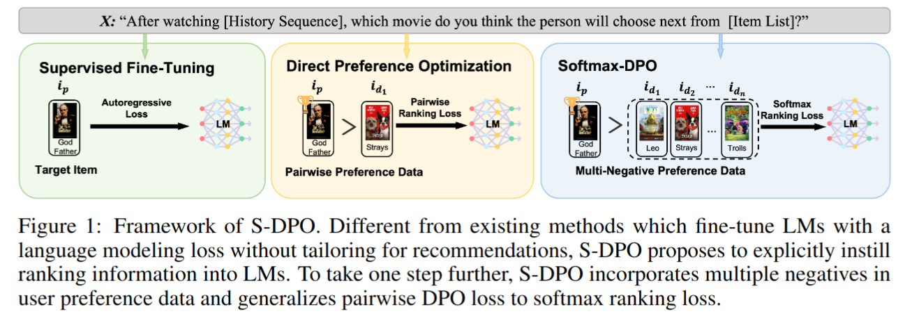
* 问题
    * 当前的LLM推荐系统主要优化正样本预测，忽略了负样本的作用，未能直接对个性化排名任务进行优化，这限制了推荐性能。
    * 现有的 DPO 方法虽然成功用于人类偏好对齐，但通常局限于成对的偏好数据（pairwise preferences），未充分考虑多个负样本的场景。
* 提出一种新方法，Softmax-DPO (S-DPO)，通过引入多个负样本，将排名信息显式注入LLM，从而优化其在推荐任务上的表现。
* S-DPO框架
    * 多负样本偏好分布建模
        * S-DPO利用Plackett-Luce (PL) 模型构建偏好分布，PL模型假设给定用户偏好顺序 $ \tau $，序列 $ e_{\tau(1)}, e_{\tau(2)}, \dots, e_{\tau(K)} $ 的概率为：
        $$
        p(\tau | e_1, e_2, \dots, e_K, x_u) = \prod_{j=1}^K \frac{\exp(r(x_u, e_{\tau(j)}))}{\sum_{l=j}^K \exp(r(x_u, e_{\tau(l)}))}
        $$
        * 对于推荐任务中的部分排序问题，优先考虑正样本 $ e_p $，并枚举所有以 $ e_p $ 开头的偏好顺序，最终得到多负样本偏好分布：
        $$
        p^*(e_p \succ e_d, \forall e_d \in E_d | x_u) = \frac{\exp(r(x_u, e_p))}{\sum_{j=1}^K \exp(r(x_u, e_j))}
        $$
    * S-DPO损失推导
        - 将奖励函数 $ r(x_u, e) $ 替换为DPO中的定义：  
        $$
        r(x_u, e) = \beta \log \frac{\pi_\theta(e | x_u)}{\pi_{ref}(e | x_u)}
        $$
        将其代入偏好分布公式后，S-DPO的损失函数可表示为：
        $$
        L_{S-DPO} = - \mathbb{E}_{(x_u, e_p, E_d)} \left[ \log \sigma \left( -\log \sum_{e_d \in E_d} \exp \left( \beta \log \frac{\pi_\theta(e_d | x_u)}{\pi_{ref}(e_d | x_u)} - \beta \log \frac{\pi_\theta(e_p | x_u)}{\pi_{ref}(e_p | x_u)} \right) \right) \right]
        $$
        - 当负样本数 $ N $ 为2时，S-DPO退化为DPO。
    * 梯度分析
        - S-DPO的梯度公式为：
        $$
        \nabla_\theta L_{S-DPO} = - \beta \mathbb{E}_{(x_u, e_p, E_d)} \left[ \sigma \left( \log \sum_{e_d \in E_d} \exp(g(e_d, e_p, x_u)) \right) \cdot \left( \nabla_\theta \log \pi_\theta(e_p | x_u) - \sum_{e_d \in E_d} w_d \nabla_\theta \log \pi_\theta(e_d | x_u) \right) \right]
        $$
        其中：
        - $ g(e_j, e_k, x_u) = r_\theta(x_u, e_j) - r_\theta(x_u, e_k) $
        - $ w_d = \frac{\exp(r_\theta(x_u, e_d))}{\sum_{e_d' \in E_d} \exp(r_\theta(x_u, e_d'))} $

        - **Hard Negative Mining**  
            - S-DPO通过权重 $ w_d $ 对负样本进行区分，赋予奖励较高的“困难负样本”更高的权重，从而引导模型更有效地优化。

* 优势
    * 与Softmax损失的关联：与Softmax损失在多负样本场景中功能类似，能够提供更有效的排名梯度，优于传统BPR(Bipartite Ranking Loss)损失
    * Hard Negative Mining：内置困难负样本挖掘机制，能够自动对负样本进行加权，提升模型对困难负样本的区分能力


## 模态注入 (Modality Injection)
#### LLaRA [[arxiv](https://arxiv.org/abs/2312.02445)] [[pdf](./LLM-Based-Rec-Papers/sigir24-llara.pdf)]
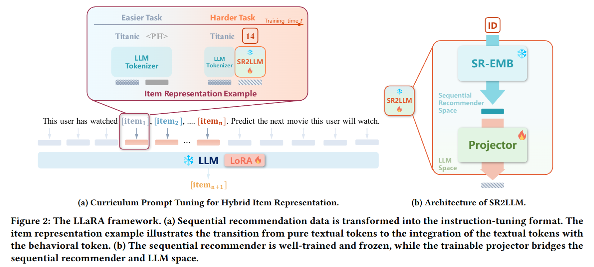

Large Language-Recommendation Assistant

* 问题
    * 当前的LLM推荐方法大多仅使用基于ID的表示或基于文本的表示：
        * ID表示：如使用数字ID或随机初始化的ID token，无法利用LLM的语义处理能力
        * 文本表示：如使用物品的标题或描述，虽然能激发LLM的语义能力，但难以捕捉用户的行为模式
    * 仅依赖ID或文本表示的提示设计难以充分利用LLM的潜力，同时忽视了传统推荐模型对用户行为模式的学习

* 提出一种新框架，结合传统推荐模型的行为模式捕捉能力与LLM的语义处理能力，开发一个更强大的推荐系统

* 框架：通过混合表示（Hybrid Representation）将传统推荐模型的行为嵌入（Behavioral Embeddings）与物品的文本特征结合起来，为LLM提供更全面的输入

    * Hybrid Prompting
        * 物品表示
            * 文本表示 Textual Token Representation
                * 使用物品的文本元数据生成文本token
                $$<\text{emb}_i^t> = \text{LLM-TKZ}(txt_i)$$
            * 行为表示 Behavioral Token Representation
                * 使用传统顺序推荐模（GRU4Rec、Caser、SASRec）学习基于ID的物品嵌入
                $$e_i^s = \text{SR-EMB}(i; \Theta_e)$$
                * 为使ID嵌入与LLM空间兼容，使用一个可训练的投影模块将嵌入映射到语言空间
                $$<\text{emb}_i^s> = \text{Proj}(e_i^s; \Theta_p), \text{这里是一个2层MLP}$$
                
            * 混合表示 Hybrid Token Representation
                * 将文本token和行为token结合起来，形成综合的物品表示
                $$<\text{emb}_i^c> = \text{Concat}(<\text{emb}_i^t>, <\text{emb}_i^s>)$$
        * 混合提示设计
            * 任务定义：描述推荐任务（如“预测用户将观看的下一步电影”）
            * 交互序列：使用 `Hybrid Token Representation` 表示用户的历史交互序列
            $$[\text{emb}_{h_1}^c, \text{emb}_{h_2}^c, \dots, \text{emb}_{h_n}^c]$$
            * 候选集：使用 `Hybrid Token Representation` 表示候选物品集
            $$[\text{emb}_{c_1}^c, \text{emb}_{c_2}^c, \dots, \text{emb}_{c_m}^c]$$
            * 如此，混合提示结合了物品的语义信息，还融合了传统推荐模型学习的用户行为模式，从而生成更全面的推荐输入
    * Cirriculum Prompt Tuning 课程提示调优：简单到复杂
        * 课程学习阶段
            * 复杂性评估 Complexity Assessment
                * 简单任务：Text-only Prompting
                * 复杂任务：Hybrid Prompting
            * 训练调度 Scheduler Formulation
                * 通过调度函数逐步从简单任务转向复杂任务
                $$p(\tau) = \frac{\tau}{T}, \ 0 \leq \tau \leq T$$
            * 训练执行 Training Execution
                * 在训练过程中，使用指示函数随机选择简单任务或复杂任务：
                $$
                I(\tau) =
                \begin{cases}
                1, & \text{学习复杂任务（概率 } p(\tau) \text{）} \\
                0, & \text{学习简单任务（概率 } 1 - p(\tau) \text{）}
                \end{cases}
                $$
                * 最终的学习目标为：
                $$
                \min_{\Theta, \Theta_p} \sum_{(x, y) \in Z} \left[ (1 - I(\tau)) L_{\text{easy}}(x, y) + I(\tau) L_{\text{hard}}(x, y) \right]
                $$
                其中，$L_{\text{easy}}$ 和 $L_{\text{hard}}$ 分别是简单任务和复杂任务的损失函数。
        * 优化与实现
            * LoRA调参
            * 逐步学习


## 推荐中的LLM解码 (Decoding in LLM for Recommendation)
#### D3 [[arxiv](https://arxiv.org/abs/2406.14900)] [[pdf](./LLM-Based-Rec-Papers/2406.14900v3.pdf)]

Decoding Matters: Addressing Amplification Bias and Homogeneity Issue for LLM-based Recommendation —— Debiasing-Diversifying Decoding

* LLM生成推荐中的两个关键问题：
    * 放大偏差 Amplification Bias
        * 部分物品包含生成概率为1的token(幽灵token)，这些token的高概率会导致推荐分数被过度放大，尤其在 length normalization 中
    * 同质化问题 Homogeneity Issue
        * LLM 倾向于生成具有相似结构和内容的推荐物品，导致缺乏diversity
* D3框架
    * Debiasing
        * 通过排除幽灵token，避免其对长度归一化计算的影响
            * 初步尝试：仅对正常token进行长度归一化，而排除幽灵token
            * 分析发现：去除幽灵token之后，使得长度皈依话变得不重要
            * 最终决定：完全移除长度归一化，直接消除放大误差 
    * Diversifying
        * 引入一个文本无关的辅助模型（Text-Free Assistant Model），在decoding过程中动态调整生成分数，提升推荐结果的多样性
        * 辅助模型作用
            * 提供对生成token的额外评分，优先考虑LLM生成概率较低但具有潜在意义的token
            * 避免过度依赖LLM的语言特性，减少重复生成
        * 具体设计
            1. 辅助模型评分计算
                * 给定当前生成的token序列$ h_{<t} $，辅助模型计算下一个token $ h_t $ 的分数：
                $$
                L_{TF}(h_t | h_{<t}) = \log \frac{\sum_{i \in I_{h<t, h_t}} p_{TF}(I_i)}{\sum_{i \in I_{h<t}} p_{TF}(I_i)}
                $$
            2. 新的总分数计算
                * 将辅助模型的分数与LLM的分数结合，得到新的解码分数：
                $$
                \tilde{S}(h_{\leq t}) = \alpha \cdot S(h_{\leq t}) + (1 - \alpha) \cdot S_{TF}(h_{\leq t})
                $$


## 推荐中的智能体 (Agent in Rec)

#### Agent4Rec [[acm](https://dl.acm.org/doi/pdf/10.1145/3626772.3657844)] [[pdf](./LLM-Based-Rec-Papers/3626772.3657844.pdf)]
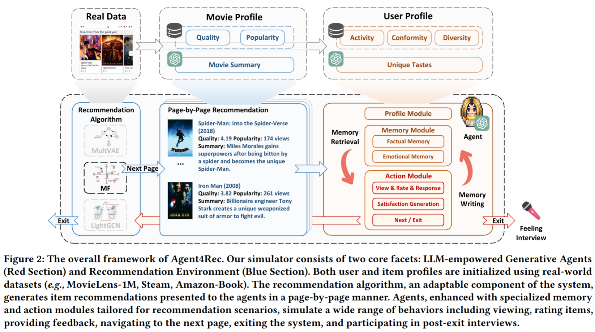

* 构建一个通用的模拟推荐平台Agent4Rec，通过LLM驱动的生成agents模拟用户行为，从而
    1. 模拟用户行为：生成个性化的用户偏好和行为模式
    2. 评估推荐算法：在模拟环境中测试推荐算法的性能
    3. 研究推荐问题

* Agent4Rec框架
    1. Generative Agents：设计高度还原人类行为的agents，包含用户档案，记忆和行为模块
        * 用户档案模块 Profile Module
            1. 社会特征 Social Traits
                * 活跃度 Activity：用户与推荐物品交互的频率
                $$ T_u^{act} = \sum_{i \in I} y_{ui} $$
                * 一致性 Conformity：用户评分与平均评分的偏离程度
                $$ T_u^{conf} = \frac{1}{\sum_{i \in I} y_{ui}} \sum_{i \in I} y_{ui} \cdot |r_{ui} - R_i|^2 $$
                * 多样性 Diversity：用户偏好的物品类别数量
                $$ T_u^{div} = |\bigcup_{i \in \{y_{ui}=1\}} G_i| $$
            2. 独特偏好 Unique Tastes
                * 从用户历史记录中随机选择25个物品
                * 评分$\ge 3$的标记为喜欢，其余不喜欢
                * 使用GPT生成用户的个性化偏好描述

        * 记忆模块 Memory Module
            1. 事实记忆 Factual Memory
                * 推荐清单、用户反馈（观看与否、评分、退出行为等）
            2. 感情记忆 Emotional Memory
                * 记录系统交互过程中的感情状态，如疲劳度和满意度等
            * 操作机制
                * Memory Retrieval：提取与当前任务相关的信息
                * Memory Writing：将新互动和情感状态写入记忆流
                * Memory Reflection：agent执行的操作超过特定次数，触发反思机制。通过LLM评估推荐的满意度和疲劳度等，调整行为策略
        * 行动模块 Action Module
            1. 偏好驱动的行为 Taste-driven Actions
                * View：根据偏好选择观看取品
                * Rate：对观看物品打分
                * Genearte Feelings：记录观看后的情感体验
            2. 情感驱动的行为 Emotion-driven Actions
                * Exit：根据满意度和疲劳度确定是否退出
                * Rate Recommender：对推荐系统进行整体评分
                * Post-Exit Interview：在退出后提供详细反馈，解释其行为和偏好
            * 行为生成机制：使用CoT辅助agent在推荐页面上作出决策
    2. Recommendation Environment：构建与真实世界相似的推荐场景，支持多种推荐算法
        * 物品档案生成 Item Profile Generation
            * profile中包含：
                * Quality：基于历史评分计算
                * Popularity：根据用户评论数量计算
                * Genre and Summary：利用LLM生成取品类别和简要描述
            * 处理：
                * 少样本学习，让LLM根据物品标题分类和生成摘要
                * 为避免 Hallucination ，移除LLM分类结果错误的物品
        * 分页推荐场景 Page-by-Page Recommendation Scenario
            * 模拟真实平台的分页推荐方式
            * 每页展示多个推荐物品，用户可选择观看、评分或退出
            * 下一页的推荐结果可根据用户行为进行调整

        * 推荐算法设计 Recommendation Algorithm Designs
            * 提供预实现的协同过滤算法，包括随机推荐、热门推荐、矩阵分解、LightGCN和MultVAE
            * 支持开放接口，可集成外部推荐算法，扩展系统功能

#### InteRecAgent [[arxiv](https://arxiv.org/abs/2308.16505)] [[pdf](./LLM-Based-Rec-Papers/2308.16505v3.pdf)]
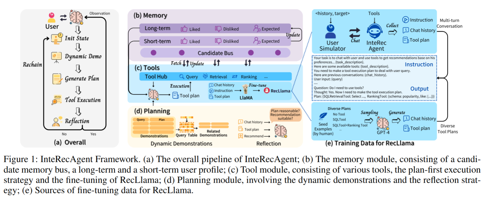

* 问题
    * LLM在推荐任务中缺乏对新物品和领域特定数据的认知，直接fine-tune成本高且效率低
    * 推荐系统难以在用户交互中提供对话式推荐，解释和复杂的任务处理
* 提出一个InteRecAgent，将LLM的通用能力与传统推荐模型的邻域只是结合，打造交互式、个性化的推荐系统
* InteRecAgent框架
    1. Tools：处理推荐系统的工具集，包括查询、检索和排序工具
        1. Query Tool
            * 处理用户关于物品属性的询问（价格、发布时间等）
            * 使用SQL查询物品数据库
        2. Retrieval Tools
            * 硬条件检索工具 SQL Retrieval Tool：基于明确条件（价格、类别等）筛选物品
            * 软条件检索工具 ItemCF Retrieval Tool：基于物品间的相似性进行检索
        3. Ranking Tool
            * 对候选物品进行排序或过滤
            * 排序模式包括基于Popularity, Similarity或用户的 Preference
    2. Memory Mechanism：管理用户偏好和候选物品的存储与传递
        1. Candidate Bus 候选物品总线
            * 存储工具间共享的候选物品，解决输入长度限制问题
            * 支持候选物品度逐步过滤，形成类似漏斗的推荐结构
        2. User Profile 用户档案
            * 包含用户的 like、dislike 和 expect 三个偏好维度
            * 分为短期记忆（当前对话）和长期记忆（历史对话），确保系统能适应长时间、多回合的交互
        3. Task Planning：Plan-First Execution 计划优先执行，降低推理成本并提高执行效率
            * Plan 计划阶段
                * LLM根据用户意图生成完整的工具调用计划
                * 每个计划包含工具名称和输入参数，比如
                ```json
                [
                {"tool": "SQL Retrieval Tool", "input": "SELECT * FROM items WHERE genre='puzzle' AND release_date > '2018-07-25'"},
                {"tool": "Ranking Tool", "input": {"schema": "preference", "prefer": ["Fortnite", "Call of Duty"]}}
                ]
                ```
            * Execution 执行阶段
                * 按计划顺序调用工具，更新候选物品总线
                * 仅最后一个工具的输出作为LLM的观察结果，用于生成最终响应
    4. Reflection Mechanism：Actor-Critic机制过自我反思增强系统的错误纠正能力
        * Actor：负责生成工具调用计划并执行任务
        * Critic：评估任务与执行结果是否合理，发现错误并提供反馈（合理则返回响应，不合理则提供反馈并要求Actor重新生成计划）
    5. Tool Learning with Small Language Models：微调LLaMA模型实现对GPT-4能力的模仿
        * 开发叫做RecLlama的“小语言模型：
        * 数据生成：使用GPT-4与用户模拟器交互生成工具调用计划，形成训练数据
        * 模型微调：LLaMa2-7B微调，结果显示RecLlama在多个领域超过了更大的语言模型
（类似蒸馏技术）


## LLM增强推荐 (LLM-Enhanced Recommendation)
#### RLMRec [[arxiv](https://arxiv.org/abs/2310.15950)] [[pdf](./LLM-Based-Rec-Papers/2310.15950v5.pdf)]

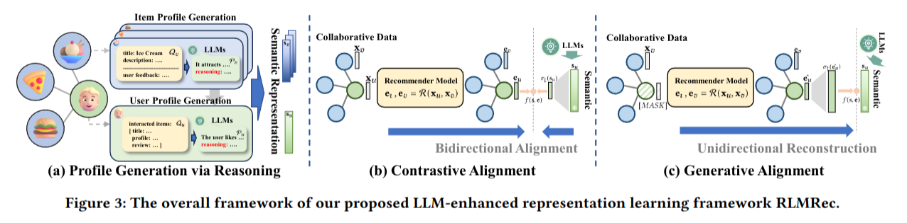

* 问题：
    * ID信息的局限性：现有推荐模型主要依赖ID数据，缺乏语义信息，无法充分捕捉用户偏好
    * 隐式反馈的噪声：用户交互数据可能含有噪声（误点击、未交互但感兴趣的物品等）
    * 直接使用LLMs的挑战
        * 扩展性问题：LLMs对大规模用户行为数据的处理很贵
        * 文本依赖性：LLMs可能生成不存在的物品（Halluciation），且受限于token长度，无法建模全局协作信号
* 提出一个框架 RLMRec，通过结合LLMs的语义能力和推荐系统的协作信号，改进用户和物品的表示学习，从而提升推荐系统的性能

* 框架：一个模型无关的表示学习框架，旨在通过对比学习和生成建模，实现协作信号与LLMs的语义表示之间的对齐，提升推荐性能

    1. Profiling 用户/物品档案生成
        * profile生成目标
            * item profile：描述物品的特性，如适合的用户类型和吸引力
            * user profile：描述用户的偏好，如喜欢的物品类型和行为特征
        * profile生成过程
            1. item profile
                - 输入：物品的标题、描述、属性（如类别、价格）和用户评论。
                - 通过LLMs生成物品的语义描述和吸引力分析。
                - 示例：
                    ```
                    Summarization: This book appeals to readers interested in mental health and women's experiences.
                    Reasoning: The book delves into a young woman's mental breakdown, providing insights into mental health and societal expectations.
                    ```
            2. user profile
                - 输入：用户的交互物品（物品档案）和用户评论。
                - 通过LLMs生成用户的个性化偏好描述。
                - 示例：
                    ```
                    Summarization: The user enjoys young adult fiction that blends paranormal elements with romance and humor.
                    Reasoning: Based on reviews, the user prefers stories with supernatural themes and a mix of romance and humor.
                    ```
    2. Representation Alignment 表示对齐
        * 对比学习（Contrastive Alignment）
            * 拉近正样本并推远负样本，实现双向对齐
            * 余弦相似度作为相似性度量
            $$f(s_i, e_i) = \exp(\text{cos}(\sigma_\downarrow(s_i), e_i))$$
            * 优化目标
            $$L = -\mathbb{E} \left[ \log \frac{f(s_i, e_i)}{\sum_{s_j \in S} f(s_j, e_i)} $$
        * 生成对齐（Generative Alignment）
            * 通过生成建模，使用协作关系e重构语义表示s
            * 使用掩码重建机制（MAE等），对部分用户/物品embedding进行mask并重建
            $$f(s_i, e_i) = \exp(\text{cos}(s_i, \sigma_\uparrow(\hat{e}_i)))$$
            * $\hat{e}_i$ 表示掩码后的表示，优化目标类似对比对齐


    3. Model-Agnostic Optimization 模型无关优化
        * 结合对齐损失和推荐损失，支持任何基于表示学习的推荐模型
        * 总体优化目标是$L = L_R + L_\text{info}$即推荐模型的原始损失（交叉熵等）和互信息最大化损失（用于实现协作关系表示和语义表示的对齐）

#### AlphaRec [[arxiv](https://arxiv.org/abs/2407.05441)] [[pdf](./LLM-Based-Rec-Papers/2407.05441v2.pdf)]

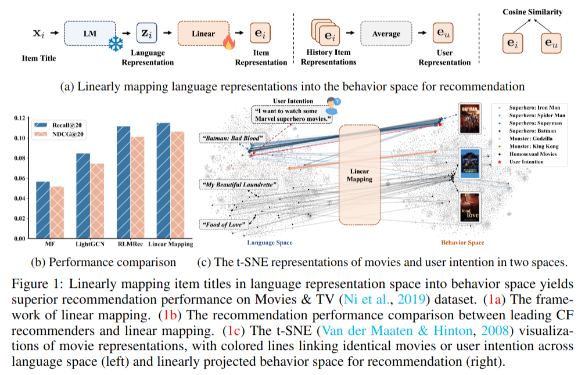

* 问题
    * LM是否隐式编码了协同信号？即LM生成的语义表示能否直接反映用户偏好的相似性
    * 如何设计基于语言表示的推荐框架？即能否完全抛弃ID嵌入，基于语言表示构建协同过滤模型，并超越传统的ID-based推荐系统？
* 提出一个简单但高效的推荐模型 AlphaRec，基于语言模型生成的物品语义表示，通过`非线性投影`、`图卷积`和`对比学习`，构建先进的协同过滤模型

* AlphaRec框架
    1. Language Representation Generation：预训练LM生成物品的语义表示
        * 预训练语言模型提取物品的语义表示
        * 用户的语义表示未其历史交互物品的平均值$z_u = \frac{1}{|N_u|} \sum_{i \in N_u} z_i$
    2. Nonlinear Projection：MLP做做非线性变换，生成初始用户和物品的行为表示
        * 两层MLP将语言表示映射到推荐行为空间，挖掘更深层次的用户偏好相似性
        $$
        e^{(0)}_i = W_2 \cdot \text{LeakyReLU}(W_1 \cdot z_i + b_1) + b_2
        \\
        e^{(0)}_u = W_2 \cdot \text{LeakyReLU}(W_1 \cdot z_u + b_1) + b_2
        $$
    3. Graph Convolution：使用用户-物品交互图，递归地聚合高阶协同信号
        * 用户节点更新
        $$ e^{(k+1)}_u = \sum_{i \in N_u} \frac{1}{\sqrt{|N_u|} \cdot \sqrt{|N_i|}} e^{(k)}_i $$
        * 物品节点更新
        $$e^{(k+1)}_i = \sum_{u \in N_i} \frac{1}{\sqrt{|N_i|} \cdot \sqrt{|N_u|}} e^{(k)}_u$$
        * 最终表示为所有层输出的平均
        $$e_u = \frac{1}{K+1} \sum_{k=0}^K e^{(k)}_u, \quad e_i = \frac{1}{K+1} \sum_{k=0}^K e^{(k)}_i$$
    4. Contrastive Learning：使用infoNCE损失优化用户和物品的行为表示
        * 通过拉近正样本对（用户预期交互物品）并远离负样本对，增强表示的区分性
        $$
        L_\text{InfoNCE} = - \sum_{(u,i) \in O^+} \log \frac{\exp(s(e_u, e_i) / \tau)}{\exp(s(e_u, e_i) / \tau) + \sum_{j \in S_u} \exp(s(e_u, e_j) / \tau)}
        \\
        s(e_u, e_i) = \frac{e_u^\top e_i}{\|e_u\| \cdot \|e_i\|}
        $$
        - $ O^+ $：正样本对集合
        - $ S_u $：用户 $ u $ 的随机负样本集合
        - $ \tau $：温度超参数

## 会话式推荐 (Conversational Recommendation)
#### Large Language Models as Zero-Shot Conversational Recommenders [[acm](https://dl.acm.org/doi/pdf/10.1145/3583780.3614949)] [[pdf](./LLM-Based-Rec-Papers/3583780.3614949.pdf)]

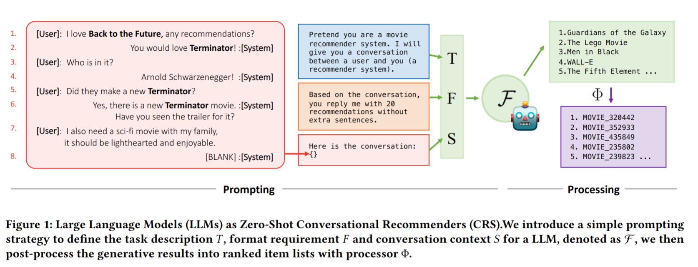

* 问题
    * 现有CRS模型依赖于精细调优，但LLMs能否zero-shot直接用于对话式推荐任务？
    * LLMs在CRS场景中的表现背后的机制尚不清楚
        * 是都利用了协同知识 Collaborative Knowledge
        * 更多依赖内容/上下文知识 Content/Context Knowledge
* 贡献
    1. 数据集：构建Reddit-Movie数据集
    2. 评估
        * 发现现有CRS评估存在“重复物品捷径 Repeated Item Shortcut”问题
        * 在三个数据集（ReDIAL、INSPIRED、Reddit-Movie）上重新评估LLMs和现有CRS模型
    3. 分析：通过 Probing Tasks 研究LLMs在对话式推荐中的工作机制，揭示其优势和局限性

* 框架：不做fine-tune，直接利用LLMs在零样本场景下完成对话式推荐任务
    1. Prompting
        * Task Description, T
        * Format Requirements, F
        * Conversation Context, S
        $$
        \hat{I}_k = \Phi(F(T, F, S))
        $$
        * - \(F\)：大语言模型。\(\Phi\)：后处理模块，将生成的自然语言结果转为排序的物品列表。
    2. Model Selection
        * 闭源：GPT-3.5-turbo和GPT-4
        * 开源：Vicuna和BAIZE（LLaMA-13B微调）
    3. Post-Processing
        * 使用模糊匹配（Fuzzy Matching）将LLMs生成的自然语言推荐列表对齐到目标物品集合
        * 对生成的物品标题做字符串匹配，过滤有意义的推荐

## 基于代码本的推荐 (Codebook-Based Recommendation)

#### TIGER [[nips](https://proceedings.neurips.cc/paper_files/paper/2023/file/20dcab0f14046a5c6b02b61da9f13229-Paper-Conference.pdf)] [[pdf](./papers/Recommender-Systems-with-Generative-Retrieval.pdf)]

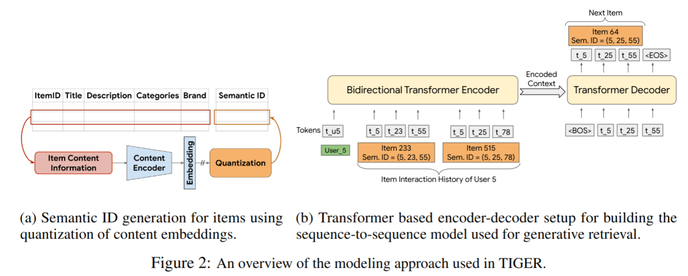

* 提出一种新范式，将 Generative Retrieval 引入推荐系统。通过直接生成物品的 Semantic ID，避免依赖大型嵌入表，并提升冷启动能力和泛化性能

* TIGER框架
    1. Semantic ID Generation
        1. 语义嵌入生成：与训练文本编辑器
        2. Hierarchical Quantization 分层量化：RQ-VAE
        3. 语义ID的特点
            * 语义相似性
            * 可扩展性
            * 冲突管理  
    2. 基于Semantic ID的生成式检索
        * 输入用户历史行为数据，转换为语义ID序列
        * 生成式模型：基于Transformer的seq2seq模型
            * encoder对输入的用户历史语义ID序列进行编码
            * decoder自回归地生成下一个语义ID
        * 特点：
            * 无需嵌入表
            * 冷启动能力
            * 生成多样性


###  如何设计代码本:
####  How to Index Item IDs for Recommendation Foundation Models [[acm](https://dl.acm.org/doi/pdf/10.1145/3624918.3625339)] [[pdf](./LLM-Based-Rec-Papers/3624918.3625339.pdf)]

* 生成式推荐的挑战
    * Halluciation：LLMs可能生成不存在的物品描述
    * ID分配问题：
        * 每个物品需要ID
        * ID应兼容自然语言以适应LLM的训练和推理
    * 现有索引方法的局限性
        * 随机索引，标题索引可能引入噪声或偏差，影响模型性能
* 系统性研究和设计适合推荐基础模型的物品ID创建与索引方法，以提升LLM推荐模型的性能

* 方法
    1. 简单索引方法
        * Random Indexing, RID：不相关物品可能共享子token，导致训练引入噪声，且随机性导致模型难以捕捉物品间的关系
        * Title Indexing, TID：标题可能过长，增加生成难度，且标题中的词可能带有噪声或误差（如“The Lord of the Rings”和“The Lord of War”共享许多token但物品差异大）
        * Independent Indexing, IID：需要为每个物品创建大量新token，训练成本高，且无法捕捉物品之间的协作或语义关系
    2. 高级索引方法
        1. Sequential Indexing, SID
            * 基于用户的交互顺序为物品分配连续的数字ID
                * 从第一个用户开始，按照物品交互顺序分配ID（1001, 1002等）
                * 相邻物品共享部分token（如1001和1002共享“100”）
            * 简单易实现，能捕捉部分协同信息
            * 但是，不同用户的交互顺序会影响索引结果，且无法捕捉频繁共现物品之间的强相关性
        2. Collaborative Indexing, CID
            * 基于物品共现信息构建索引，使频繁共现的物品共享更多token
            * 实现
                1. 构建共现图：节点表示物品，边的权重表示物品共现次数
                2. 谱聚类 Spectral Clustering：生成层次化的簇（如<1><9><5><4>）
                3. 分配ID：每个簇分配独立token，最终ID由簇的token和物品的唯一token拼接而成
            * 能有效捕捉物品之间的协同关系
        3. Semantic Indexing, SemID
            * 利用物品的元数据构建层次化ID
            * 实现
                1. 根据物品的类别信息构建树状结构
                2. 从根节点到叶节点的路径表示物品ID（如⟨Makeup⟩⟨Lips⟩⟨Lip_Liners⟩⟨5⟩）
            * 能捕捉物品的语义信息
            * 但是，若类别结构不是树而是图（如某类目出现在多个父节点下），可能降低性能
        4. Hybrid Indexing, HID
            * 结合多种索引方法，兼顾协同信息和语义信息
            * 实现
                * CID+IID：在协同索引结果后追加独立token（如<1><9><5>< IID28>）
                * SemID+IID：在语义索引结果后追加独立token（如⟨Makeup⟩⟨Lips⟩⟨Lip_Liners⟩⟨IID1023⟩）
                * SemID+CID：将语义索引和协同索引拼接


### Item Tokenizer
#### LETTER [[arxiv](https://arxiv.org/abs/2405.07314)] [[pdf](./LLM-Based-Rec-Papers/2405.07314v2.pdf)]

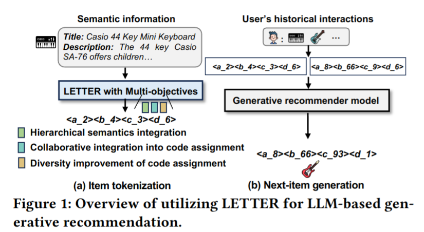

* 问题
    1. ID标识符：无法编码语义信息，难以泛化到冷启动问题
    2. 文本标识符
        * 语义信息缺乏层次性，生成概率低
        * 缺乏协同信号，无法有效区分语义相似但协同行为不同的物品
    3. 基于codebook的标识符
        * 缺乏协同信号
        * 代码分配偏差：一些高频代码被过度生成导致推荐偏差
* 希望设计一个理想的物品标识符，满足：层次化语义、协同信号、代码分配多样性
* 框架
    1. Semantic Regularization：生成带有层次化语义的标识符
        * 使用RQ-VAE
        * 语义嵌入提取 -> 语义嵌入量化 -> 生成最终标识符和量化嵌入
        * 损失函数：
            * 重构损失
            $$L_{\text{Recon}} = \|\mathbf{s} - \hat{\mathbf{s}}\|_2^2$$
            * 量化损失
            $$L_{\text{RQ-VAE}} = \sum_{l=1}^L \|\text{sg}[\mathbf{r}_{l-1}] - \mathbf{e}_{c_l}\|_2^2 + \mu \|\mathbf{r}_{l-1} - \text{sg}[\mathbf{e}_{c_l}]\|_2^2$$
            * 总损失：
            $$L_{\text{Sem}} = L_{\text{Recon}} + L_{\text{RQ-VAE}}$$
    2. Collaborative Regularization：在标识符中注入协同信号，使相似用户行为的物品共享相似代码
        * Contrastive Learning 将量化嵌入$\hat{z}$与协同嵌入h对齐
        $$L_{\text{CF}} = -\frac{1}{B} \sum_{i=1}^B \log \frac{\exp(\langle \hat{\mathbf{z}}_i, \mathbf{h}_i \rangle)}{\sum_{j=1}^B \exp(\langle \hat{\mathbf{z}}_i, \mathbf{h}_j \rangle)}$$
        * 调整代码分配，使标识符更好捕捉协同行为模式，解决语义与协同信号不匹配的问题
    3. Diversity Regularization：通过提高代码嵌入的多样性，缓解代码分配偏差
        1. 使用约束K-means将每层codebook的code嵌入划分为K个簇
        2. 定义多样性损失
        $$L_{\text{Div}} = -\frac{1}{B} \sum_{i=1}^B \log \frac{\exp(\langle \mathbf{e}_{c_l}^i, \mathbf{e}^+ \rangle)}{\sum_{\mathbf{e}_j \in \mathcal{C}_l \setminus \mathbf{e}_{c_l}^i} \exp(\langle \mathbf{e}_{c_l}^i, \mathbf{e}_j \rangle)}$$
        3. 多样性正则化通过拉近同簇内代码嵌入，推远异簇代码嵌入，提升代码分配的均衡性
    4. 总损失函数
    $$L_{\text{LETTER}} = L_{\text{Sem}} + \alpha L_{\text{CF}} + \beta L_{\text{Div}}$$
    5. LETTER实例化
        * 训练阶段
            * 使用LETTER生成物品标识符，将用户的交互序列转化为标识符序列
            * 优化生成式推荐模型（TIGER、LC-rec等）的排序指导生成损失
            $$L_{\text{rank}} = -\sum_{t=1}^{|y|} \log P_\theta(y_t | y_{<t}, x)$$
        * 推理阶段
            * 自回归地生成标识符序列，采用约束生成确保输出合法标识符


## 与LLM结合的推荐 (Combination with LLM)
#### LC-Rec [[arxiv](https://arxiv.org/abs/2311.09049)] [[pdf](./papers/Adapting-LLMs-by-Integrating-Collaborative-Semantics-for-Recommendation.pdf)]


* 问题
    * 语义鸿沟
        * LLMs无法直接理解协同语义
        * 推荐系统中的物品通常缺乏与LLMs语义空间的直接对齐方法
    * 生成式推荐的挑战
        * 如何通过LLMs直接生成全域物品，而不依赖候选项集
        * 如何有效整合语言和协同语义，使LLMs适应推荐任务

* 框架
    1. Item Indexing
        * RQ-VAE
        * Uniform Semantic Mapping, USM：语义均匀约束
    2. Alignment Tuning
        * Sequential Item Prediction
            * 将用户历史交互序列表示为物品索引序列，设计指令引导LLMs生成用户可能感兴趣的下一个物品
        * Explicit Index-Language Alignment
            * 根据物品标题和描述生成索引
            * 根据索引生成物品标题和描述
        * Implicit Recommendation-Oriented Alignment：通过复杂任务进一步整合语言和协同语义
            * Asymmetric Item Prediction
            * Item Prediction Based on User Intention
            * Personalized Preference Inference


---

## Must Know, But Do Not Need to Read
### Scaling in Recommendation:
#### HSTU [[arxiv](https://arxiv.org/abs/2402.17152)] [[pdf](./LLM-Based-Rec-Papers/2402.17152v3.pdf)]


### Basic Models:
#### LightGCN [[arxiv](https://arxiv.org/abs/2002.02126)] [[pdf](./LLM-Based-Rec-Papers/2002.02126v4.pdf)]


#### SASRec [[arxiv](https://arxiv.org/pdf/1808.09781)] [[pdf](./LLM-Based-Rec-Papers/1808.09781v1.pdf)]


### Amazon 2023 数据集:
#### Amazon 2023 Dataset [[arxiv](https://arxiv.org/abs/2403.03952)] [[pdf](./LLM-Based-Rec-Papers/2403.03952v1.pdf)]


